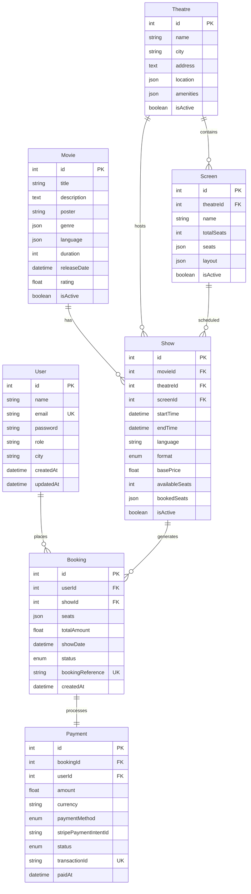

# BookMyShow Clone - Full Stack Movie Ticket Booking Application

A full-featured movie ticket booking platform built with React, TypeScript, Node.js, Express, and MySQL. This application mimics the core functionality of BookMyShow, including movie listings, theatre management, seat selection, booking, and payment processing.

##  Features

### 🎯 Core Functionality
- **🔐 Secure Authentication** – JWT-based auth with role-based access control
- **🎬 Movie Management** – Browse, search, and filter movies with rich metadata
- **🏪 Theatre & Shows** – Dynamic theatre listings with real-time show schedules
- **💺 Interactive Seat Selection** – Visual seat layout with real-time availability
- **💳 Payment Processing** – Stripe integration for secure transactions
- **👤 User Profiles** – Personal dashboards with booking history
- **🛡️ Admin Panel** – Comprehensive admin dashboard for content management

### 🎨 User Experience
- **📱 Responsive Design** – Mobile-first approach with seamless cross-device experience
- **⚡ Lightning Fast** – Optimized performance with instant loading
- **🎭 Modern UI** – Clean, intuitive interface inspired by BookMyShow
- **🔄 Real-time Updates** – Live seat availability and booking status
- **📊 Analytics Dashboard** – Revenue metrics and usage statistics

---

## 🛠️ Tech Stack

### Frontend
<table>
<tr>
<td></td>
<td></td>
<td></td>
<td></td>
<td></td>
</tr>
<tr>
<td align="center">React 18</td>
<td align="center">TypeScript</td>
<td align="center">Vite</td>
<td align="center">Tailwind CSS</td>
<td align="center">Redux Toolkit</td>
</tr>
</table>

### Backend
<table>
<tr>
<td></td>
<td></td>
<td></td>
<td></td>
<td></td>
</tr>
<tr>
<td align="center">Node.js</td>
<td align="center">Express.js</td>
<td align="center">MySQL</td>
<td align="center">Sequelize ORM</td>
<td align="center">JWT Auth</td>
</tr>
</table>

### Tools & Services
<table>
<tr>
<td></td>
<td></td>
<td></td>
<td></td>
</tr>
<tr>
<td align="center">Git</td>
<td align="center">NPM</td>
<td align="center">Stripe</td>
<td align="center">VS Code</td>
</tr>
</table>

---

## 🚀 Quick Start

### Prerequisites
- Node.js 16+ and npm
- MySQL 8.0+
- Git

### Installation

1. **Clone the repository**
   ```bash
   git clone https://github.com/Vagvedi/BookMyShow_Clone.git
   cd BookMyShow_Clone
   ```

2. **Setup Database**
   ```sql
   CREATE DATABASE bookmyshow;
   ```

3. **Environment Configuration**
   
   Backend (`.env`):
   ```env
   DB_HOST=localhost
   DB_PORT=3306
   DB_USER=root
   DB_PASSWORD=your_password
   DB_NAME=bookmyshow
   PORT=5000
   JWT_SECRET=your_secret_key
   STRIPE_SECRET_KEY=sk_test_...
   ```
   
   Frontend (`.env`):
   ```env
   VITE_API_URL=http://localhost:5000/api/v1
   VITE_STRIPE_PUBLISHABLE_KEY=pk_test_...
   ```

4. **Install Dependencies**
   ```bash
   # Backend
   cd backend && npm install
   
   # Frontend
   cd ../frontend && npm install
   ```

5. **Run the Application**
   ```bash
   # Terminal 1 - Backend
   cd backend && npm run dev
   
   # Terminal 2 - Frontend
   cd frontend && npm run dev
   ```

🎉 **Open** [http://localhost:3000](http://localhost:3000) to view the application!

---

## 📁 Project Structure

```
BookMyShow_Clone/
├── 📂 backend/                    # Node.js Express API
│   ├── 📂 config/                 # Database configuration
│   ├── 📂 middleware/             # Custom middleware
│   ├── 📂 models/                 # Sequelize models
│   │   ├── 📄 User.js
│   │   ├── 📄 Movie.js
│   │   ├── 📄 Theatre.js
│   │   ├── 📄 Screen.js
│   │   ├── 📄 Show.js
│   │   ├── 📄 Booking.js
│   │   └── 📄 Payment.js
│   ├── 📂 routes/                 # API routes
│   │   ├── 📄 auth.js
│   │   ├── 📄 movies.js
│   │   ├── 📄 theatres.js
│   │   ├── 📄 shows.js
│   │   ├── 📄 bookings.js
│   │   ├── 📄 payments.js
│   │   └── 📄 admin.js
│   ├── 📄 .env                    # Environment variables
│   ├── 📄 package.json
│   └── 📄 server.js               # Express server
├── 📂 frontend/                   # React TypeScript App
│   ├── 📂 public/                 # Static assets
│   ├── 📂 src/
│   │   ├── 📂 components/         # Reusable components
│   │   ├── 📂 pages/              # Page components
│   │   ├── 📂 services/           # API services
│   │   ├── 📂 store/              # Redux store
│   │   ├── 📂 types/              # TypeScript types
│   │   ├── 📄 App.tsx             # Main App component
│   │   └── 📄 main.tsx            # Entry point
│   ├── 📄 index.html              # HTML template
│   ├── 📄 package.json
│   └── 📄 vite.config.ts          # Vite configuration
└── 📄 README.md
```

---

## 📚 Documentation

### API Endpoints

#### Authentication
| Method | Endpoint | Description |
|--------|----------|-------------|
| `POST` | `/api/v1/auth/register` | Register new user |
| `POST` | `/api/v1/auth/login` | User login |
| `GET` | `/api/v1/auth/me` | Get current user |

#### Movies
| Method | Endpoint | Description |
|--------|----------|-------------|
| `GET` | `/api/v1/movies` | Get all movies |
| `GET` | `/api/v1/movies/:id` | Get movie by ID |
| `POST` | `/api/v1/movies` | Create movie (Admin) |

#### Bookings
| Method | Endpoint | Description |
|--------|----------|-------------|
| `POST` | `/api/v1/bookings` | Create booking |
| `GET` | `/api/v1/bookings` | Get user bookings |
| `PUT` | `/api/v1/bookings/:id/cancel` | Cancel booking |

### Database Schema



---

## 🎯 Usage Guide

### For Users
1. **Register/Login** – Create account or sign in
2. **Browse Movies** – Explore movies by genre, language, or city
3. **Select Show** – Choose theatre, date, and time
4. **Pick Seats** – Interactive seat selection with pricing
5. **Make Payment** – Secure Stripe payment processing
6. **Get Confirmation** – Receive booking details and QR code

### For Admins
1. **Access Admin Panel** – Login with admin credentials
2. **Manage Movies** – Add, edit, or remove movies
3. **Setup Theatres** – Configure theatres and screens
4. **Schedule Shows** – Create show timings and pricing
5. **Monitor Bookings** – View analytics and revenue
6. **Handle Payments** – Track transactions and refunds

---

## 🧪 Testing

### Payment Testing
Use Stripe test cards:
- **Card Number**: `4242 4242 4242 4242`
- **Expiry**: Any future date
- **CVC**: Any 3 digits

### Test Data
```sql
-- Create admin user
UPDATE Users SET role = 'ADMIN' WHERE email = 'admin@example.com';

-- Sample movie insertion
INSERT INTO Movies (title, description, poster, genre, language, duration, releaseDate, rating) 
VALUES ('Inception', 'A mind-bending thriller...', 'poster.jpg', '["Action","Sci-Fi"]', '["English"]', 148, '2024-01-01', 8.8);
```

---

## 🔧 Development

### Scripts
```bash
# Backend
npm run dev          # Start development server
npm start            # Start production server

# Frontend
npm run dev          # Start Vite dev server
npm run build        # Build for production
npm run preview      # Preview production build
npm run type-check   # TypeScript type checking
```

### Environment Variables
| Variable | Description | Required |
|----------|-------------|----------|
| `DB_HOST` | Database host | ✅ |
| `DB_PASSWORD` | Database password | ✅ |
| `JWT_SECRET` | JWT secret key | ✅ |
| `STRIPE_SECRET_KEY` | Stripe secret key | ✅ |
| `VITE_API_URL` | Frontend API URL | ✅ |
| `VITE_STRIPE_PUBLISHABLE_KEY` | Stripe publishable key | ✅ |

---

## 🤝 Contributing

We welcome contributions! Please follow these steps:

1. **Fork** the repository
2. **Create** a feature branch (`git checkout -b feature/amazing-feature`)
3. **Commit** your changes (`git commit -m 'Add amazing feature'`)
4. **Push** to the branch (`git push origin feature/amazing-feature`)
5. **Open** a Pull Request

### Development Guidelines
- Follow the existing code style
- Write meaningful commit messages
- Add tests for new features
- Update documentation as needed
- Ensure all tests pass before submitting

---

## 📄 License

This project is licensed under the ISC License – see the [LICENSE](LICENSE) file for details.

---

## 🙏 Acknowledgments

- [BookMyShow](https://bookmyshow.com/) for the inspiration
- [Stripe](https://stripe.com/) for payment processing
- [React](https://reactjs.org/) for the frontend framework
- [Express](https://expressjs.com/) for the backend framework
- All contributors and supporters

---

<div align="center">

### 🌟 Star this repository if it helped you!

[](https://github.com/Vagvedi/BookMyShow_Clone)
[](https://github.com/Vagvedi/BookMyShow_Clone/fork)
[](https://github.com/Vagvedi/BookMyShow_Clone/issues)

Made with ❤️ by [Vagvedi](https://github.com/Vagvedi)

</div>
